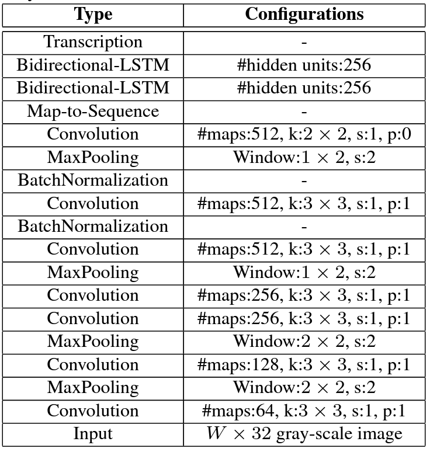

### Пример OCR с использованием CTC Loss

В качестве домашнего задания реализована архитектура CRNN из [статьи](https://arxiv.org/abs/1507.05717)


Вывод процесса обучения с метриками в файле
[slurm-1346.sh](https://github.com/SLVmain/OCR_from_scratch/blob/main/slurm-1346.out)

результат работы OCR


Запуск проекта:
1. Выполнить сборку образа
```
docker build -t ocr .
```
2. Внутри контейнера запустить обучение
```
python train.py
```

### Исходный проект:
* https://github.com/dredwardhyde/crnn-ctc-loss-pytorch
* https://github.com/Alek-dr/OCR-Example
